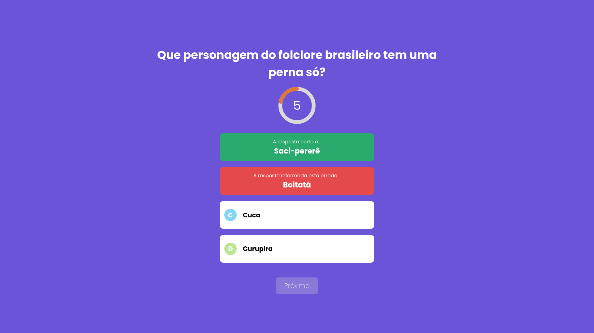

<h1 align="center">
  
</h1>

</br>

<div align="center">
  <div style="display: flex; flex-direction: column; justify-content: space-between; align-items: center; padding-right: 15%; width: 24rem;">
    
    
    
  </div>
</div>

-----------------------------------

## 📚 About

Quiz is a question and answer game, with the objective of making the player get as many questions correct as possible. Showing at the end the player's performance. 

## 🚀 Technology

- [React](https://pt-br.reactjs.org/tutorial/tutorial.html)
- [Next](https://nextjs.org/)
- [TypeScript](https://www.typescriptlang.org/)


## 🏃‍♂️ Run Project

```bash
# Clone this repository to start

$ git clone https://github.com/tmz81/Quiz-Application.git

# Access the directory dtmoney
$ cd quiz

# Instal the dependencies

$ npm install

# Run the project

$ npm start

# Access http://localhost:3000 in your browser
```